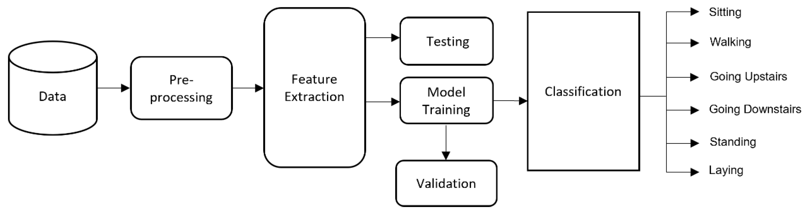
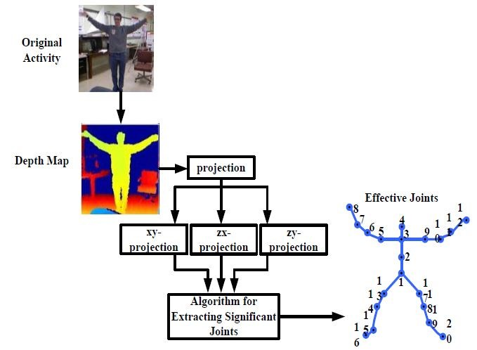

# Human Activity Recognition

  

  
    &nbsp;
  

<a href="https://github.com/githubpusp/HAR/blob/ada795e34629a7bf0c6dba3bbb3e09f4e93614c4/HAR_final_code%20(1).ipynb"> Click Here To View Result</a>
